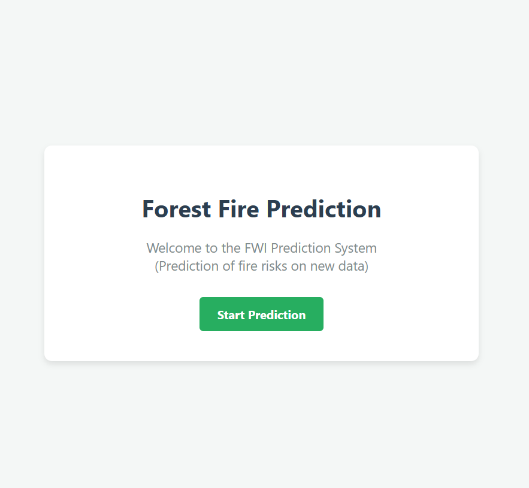
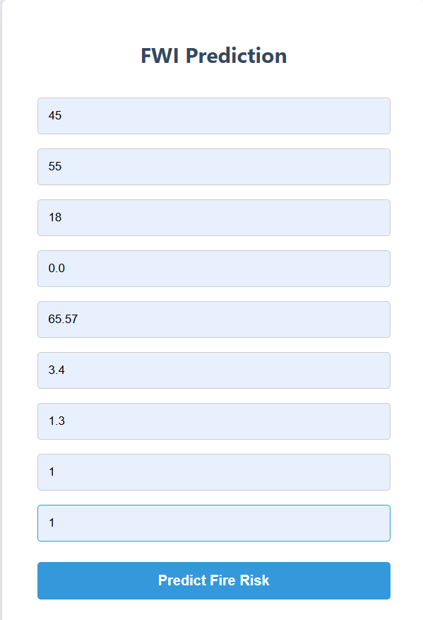

#  Forest Fire Prediction (FWI System)


##  Project Overview
This project is an End-to-End Machine Learning web application that predicts the **Fire Weather Index (FWI)**. The FWI is a critical metric used to estimate the danger of forest fires based on meteorological conditions like temperature, wind, humidity, and rain.

The model was trained on the **Algerian Forest Fires Dataset**, achieving high accuracy using **Linear Regression** (Ridge/Lasso).

## Demo
| Home Page | Prediction Result |
| :---: | :---: |
|  |  |

##  Project Structure
* **`application.py`**: The main Flask application that runs the web server.
* **`notebooks/`**: Jupyter Notebooks used for Exploratory Data Analysis (EDA) and Model Training.
* **`models/`**: Contains the saved pickle files (`model.pkl` for scaling, `model1.pkl` for prediction).
* **`templates/`**: HTML files for the user interface.
* **`Dataset/`**: The original dataset used for training.

##  Tech Stack
* **Backend:** Python, Flask
* **Machine Learning:** Scikit-Learn (Regression models), Pandas, NumPy
* **Frontend:** HTML, CSS
* **Tools:** VS Code, Git, collab

##  How to Run This Project
1.  **Clone the repository:**
    ```bash
    git clone [https://github.com/itsabhisingh07/Forest-Fire-Prediction.git](https://github.com/itsabhisingh07/Forest-Fire-Prediction.git)
    ```
2.  **Navigate to the folder:**
    ```bash
    cd Forest-Fire-Prediction
    ```
3.  **Install dependencies:**
    ```bash
    pip install -r requirements.txt
    ```
4.  **Run the application:**
    ```bash
    python application.py
    ```
5.  Open your browser and go to: `http://127.0.0.1:5000`
